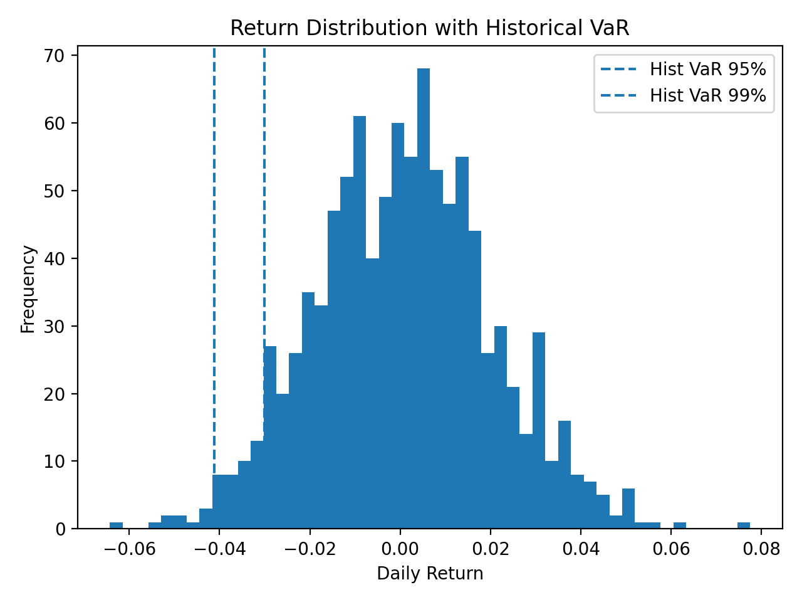
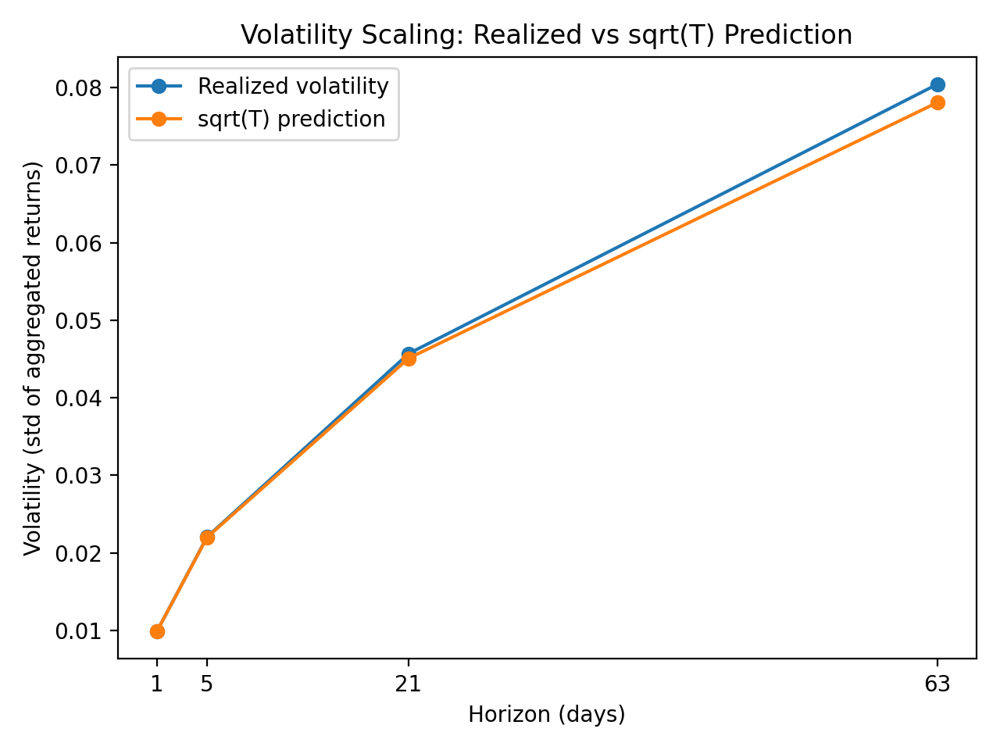

# Basic Quant Concepts

This repository contains small quantitative finance exercises implemented in Python.

## 01 – Simple vs Log Returns
- Understand compounding
- Compare simple and log returns
- Demonstrate why log returns are additive
- Visual comparison of cumulative performance
- ### Example Output

02 – Value at Risk (VaR)
- Historical VaR
- Parametric (Gaussian) VaR
- Monte Carlo VaR
  

## 03 – Volatility Scaling (√T Rule)
- Simulate daily returns
- Aggregate returns to weekly/monthly/quarterly horizons
- Compare realized volatility vs √T prediction
- Visual proof with plot

## 04 – CAPM Regression (Alpha & Beta)
- Download real market data (AAPL vs SPY)
- Compute excess returns
- Estimate alpha and beta via OLS
- Report t-stats, p-values, R²
- Visualize regression fit

More topics coming daily.
