# Basic Quant Concepts

This repository contains small quantitative finance exercises implemented in Python.

## 01 – Simple vs Log Returns
- Understand compounding
- Compare simple and log returns
- Demonstrate why log returns are additive
- Visual comparison of cumulative performance
- ### Example Output

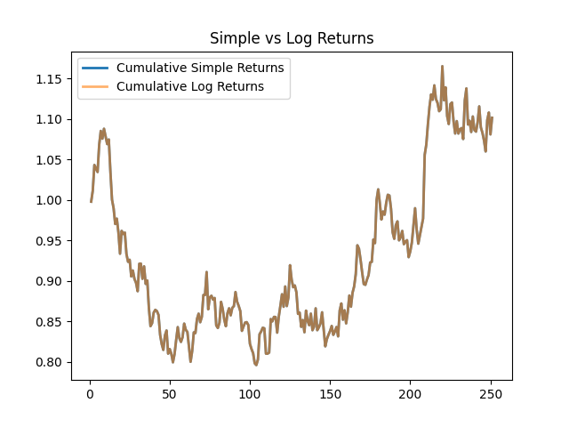

02 – Value at Risk (VaR)
- Historical VaR
- Parametric (Gaussian) VaR
- Monte Carlo VaR
  
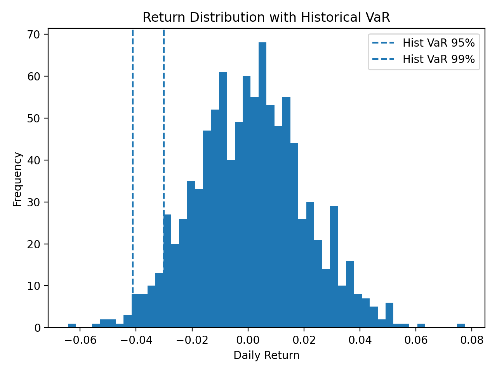

## 03 – Volatility Scaling (√T Rule)
- Simulate daily returns
- Aggregate returns to weekly/monthly/quarterly horizons
- Compare realized volatility vs √T prediction
- Visual proof with plot

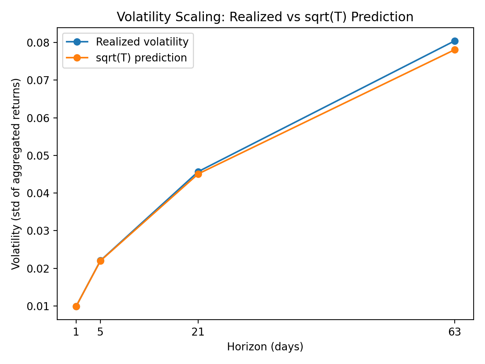

## 04 – CAPM Regression (Alpha & Beta)
- Download real market data (AAPL vs SPY)
- Compute excess returns
- Estimate alpha and beta via OLS
- Report t-stats, p-values, R²
- Visualize regression fit

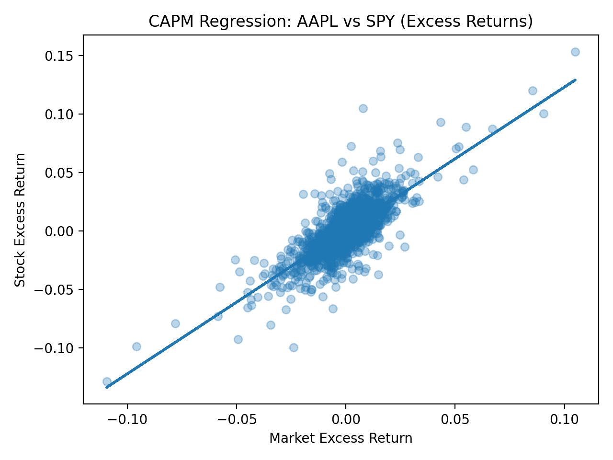

## 05 – Markowitz Portfolio Optimization
- Monte Carlo simulation of 10,000 portfolios
- Annualized return & volatility
- Sharpe ratio optimization
- Efficient frontier visualization

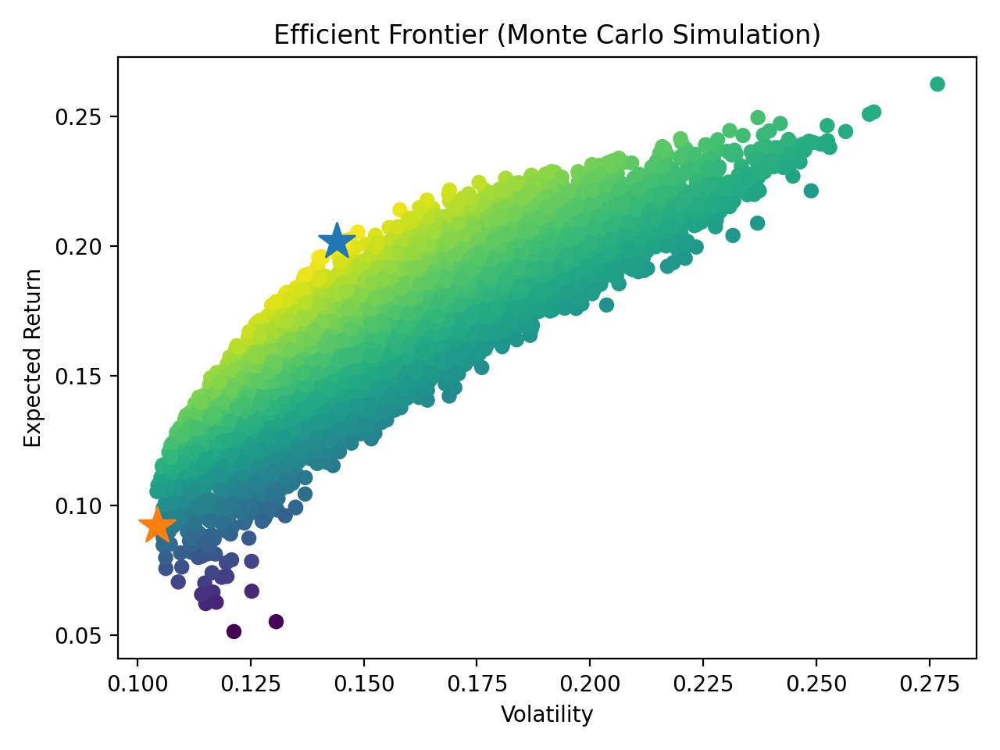

## 06 – Rolling Risk Dashboard
- Rolling 30D volatility (annualized)
- Rolling 60D Sharpe ratio
- Rolling 252D maximum drawdown
- Equity curve + risk monitoring visualization

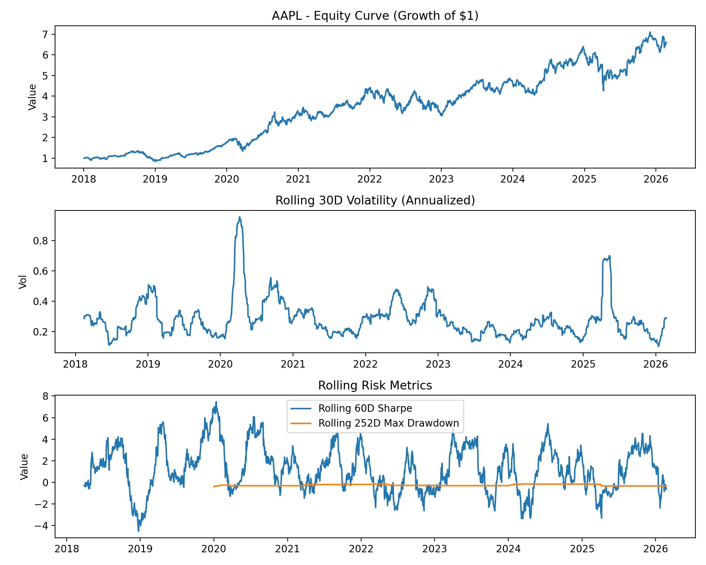

## 07 – Pairs Trading (Z-score Spread)
- Mean reversion idea using price ratio
- Rolling Z-score of KO/PEP ratio
- Entry/exit rules using Z-score thresholds
- Strategy equity curve + basic performance stats

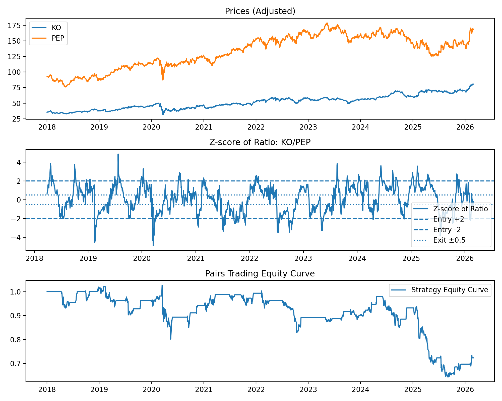

## 08 – Expected Shortfall (CVaR)
- Compare VaR and CVaR
- Historical and parametric tail-risk estimates
- Visualize tail-loss thresholds
- Show why CVaR is more conservative than VaR

  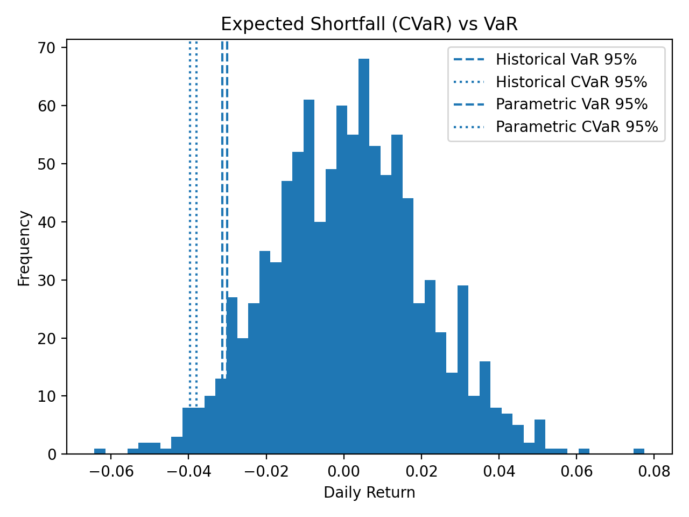

## 09 – Correlation & Diversification
- Compute covariance and correlation matrices
- Analyze relationships between assets
- Demonstrate diversification effect
- Visualize correlation heatmap

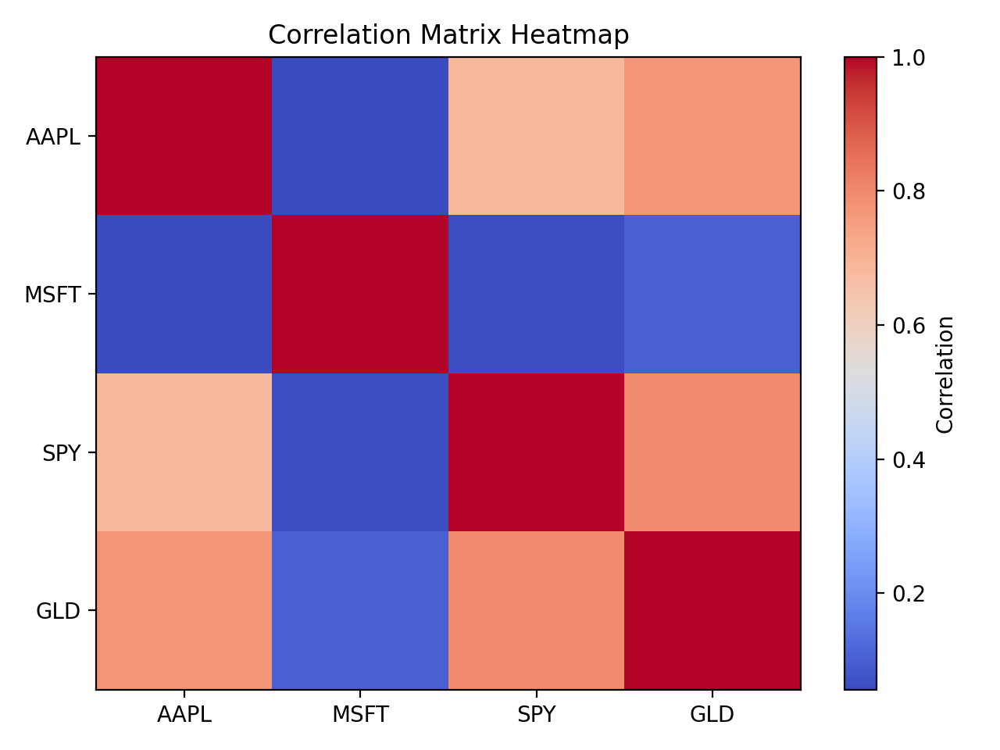

## 10 – Rolling Correlation
- Compute time-varying correlation between assets
- 60-day rolling window analysis
- Observe how relationships change over time
- Important for dynamic risk management

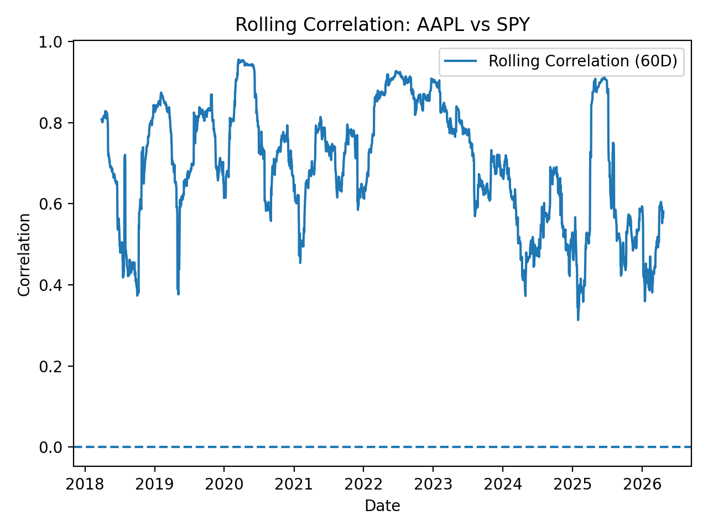

## 11 – Portfolio Beta (Factor Exposure)
- Compute beta for individual stocks using CAPM
- Calculate portfolio beta as weighted average
- Visual comparison of individual vs portfolio exposure

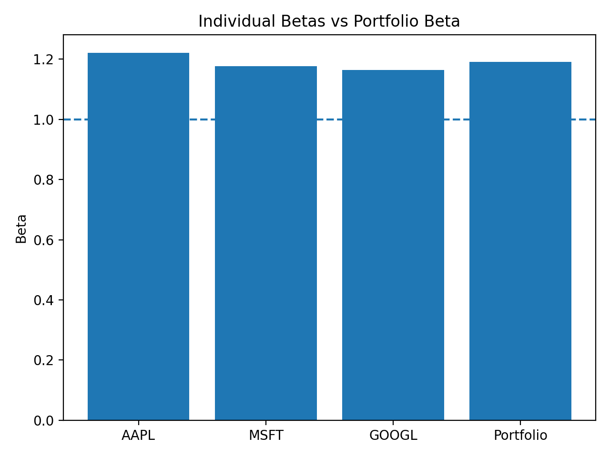

## 12 – Backtesting (Momentum Strategy)
- Implement simple momentum strategy
- Avoid look-ahead bias using signal shift
- Compare against buy-and-hold
- Evaluate performance (Sharpe, drawdown)

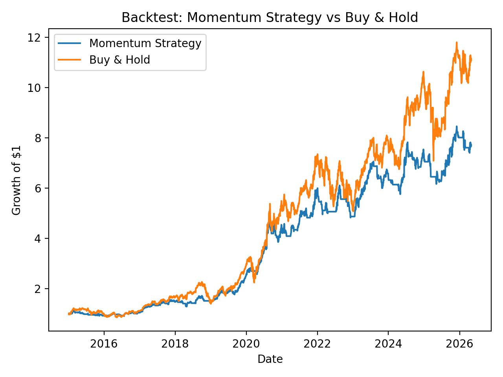

More topics coming daily.
